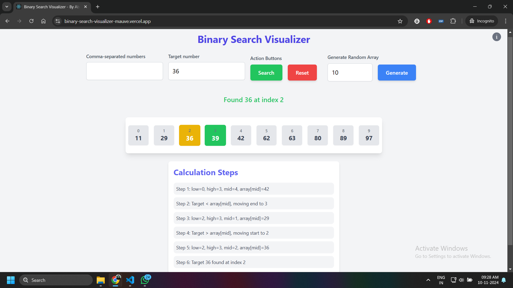

# React App: Binary Search Visualizer

Welcome to the Binary Search Visualizer! This React application helps you visualize the binary search algorithm in an interactive and intuitive way.

## Live Preview

Check out the live preview of the application [here](https://binary-search-visualizer-mauve.vercel.app/).

## Getting Started

Follow these instructions to get the project up and running on your local machine.

### Available Scripts

In the project directory, you can run:

#### `npm start`

Runs the app in development mode.\
Open [http://localhost:3000](http://localhost:3000) to view it in the browser.

The page will reload if you make edits.\
You will also see any lint errors in the console.

#### `npm run build`

Builds the app for production to the `build` folder.\
It correctly bundles React in production mode and optimizes the build for the best performance.

## Features

- Visualize the binary search algorithm step-by-step
- Interactive controls to adjust the array and search target
- Responsive design for various screen sizes

## Technologies Used

- React
- Tailwind CSS
- Font Awesome
- Heroicons

## Contributing

Contributions are welcome! Please feel free to submit a Pull Request.

## License

This project is licensed under the MIT License.
